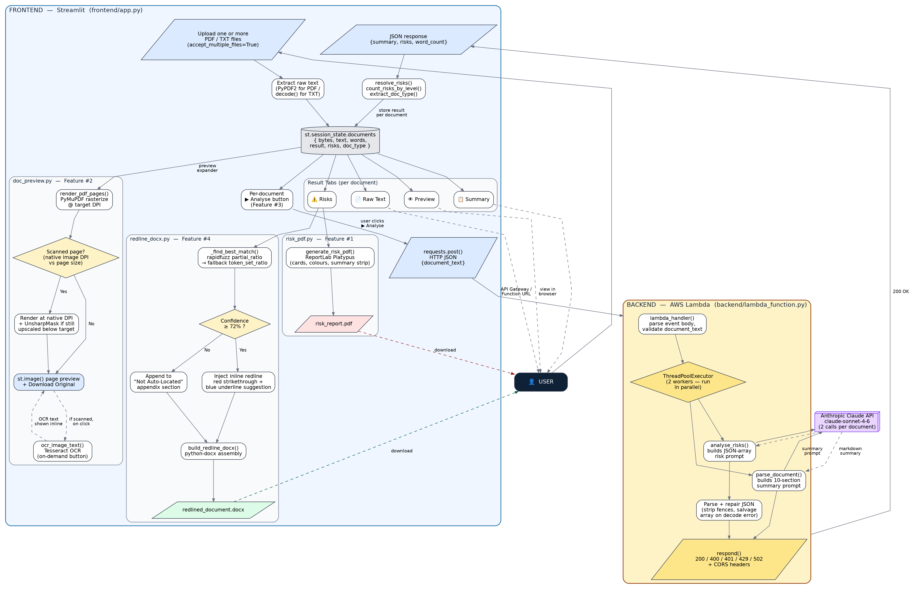

<div align="center">

# ⚖️ LexAI
### AI-Powered Legal Document Parser & Risk Analyzer

**Legal intelligence, powered by Claude.**


Upload any contract, NDA, lease, or agreement — one at a time or in batches.
Get an instant plain-English summary and a structured, severity-ranked risk report, in under a minute.

📺 **[Watch the Demo Video](https://drive.google.com/file/d/1ZWdF9gnsFAPjG6SdPd0ilw3hvjTMdquN/view?usp=sharing)** &nbsp;•&nbsp;
📄 **[Full Project Report](https://drive.google.com/file/d/1cnit9e2w76T3_QrLz8YXNS2i7cQgwqw4/view?usp=sharing)** &nbsp;•&nbsp;
📂 **[Sample Documents](https://github.com/Soureen25/LexAI/tree/main/sample_documents)**

</div>

---

## 📑 Table of Contents

- [Screenshots](#-screenshots)
- [Features](#-features)
- [System Architecture](#️-system-architecture)
- [Evaluation Results](#-evaluation-results)
- [Prerequisites](#-prerequisites)
- [Getting Started](#-getting-started)
- [How to Use](#-how-to-use)
- [Tech Stack](#️-tech-stack)
- [Known Limitations](#️-known-limitations)
- [Roadmap](#-roadmap)
- [Acknowledgements](#-acknowledgements)

---

## 📸 Screenshots

### Landing Page
Upload one or more legal documents, guided by a three-step workflow indicator and a sidebar explaining exactly what gets analysed.


### Multi-Document Upload & Overview Table
Every uploaded file is tracked in a single overview table — name, type, size, word count, AI-identified document classification, and analysis status — with an expandable preview per document.


### Document Summary
A structured, ten-section, AI-generated summary — document type, parties involved, effective date & duration, obligations, payment terms, and more.


### Risk Analysis — Flagged Clause Card
Each identified risk is shown as a card with the exact flagged clause, a plain-English explanation of why it's risky, and a concrete suggested fix.


### Risk Severity Filtering
Progressively narrow the view by severity — from High + Medium + Low, down to Medium & Low only, down to Low only — using the severity checkboxes.

<table>
<tr>
<td width="50%"><p align="center"><sub>High unchecked — Medium & Low risks shown</sub></p></td>
<td width="50%"><p align="center"><sub>High & Medium unchecked — Low risks only</sub></p></td>
</tr>
</table>

---

## ✨ Features

| # | Feature | Status |
|---|---|:---:|
| 1 | Streamlit UI | ✅ Complete |
| 2 | Digital PDF upload (single & multi-document) | ✅ Complete |
| 3 | In-app document preview | ✅ Complete |
| 4 | Digital PDF text extraction (PyPDF2) | ✅ Complete |
| 5 | Claude-generated document summary | ✅ Complete |
| 6 | AI-based risk analysis (High / Medium / Low) | ✅ Complete |
| 7 | AWS Lambda + API Gateway backend | ✅ Complete |
| 8 | Downloadable branded PDF risk report | ✅ Complete |
| 9 | Scanned PDF support (Tesseract OCR) | 🟡 Partial — preview-only, not yet wired into full analysis |
| 10 | Editable DOCX export with AI-suggested redlines | 🟡 In progress |
| 11 | Full production deployment on AWS | 🟡 In progress |
| 12 | End-to-end testing & bug fixing | 🟡 Ongoing |

**What gets analysed:**
Document type & parties · Key dates & deadlines · Obligations & payment terms · Termination clauses · Governing law · Liability & indemnification risks · Confidentiality & IP · Dispute resolution · and more (15+ risk categories in total)

---

## 🏗️ System Architecture

LexAI follows a five-layer, loosely coupled architecture, so that each layer can be modified, replaced, or scaled independently:

| Layer | Responsibility | Key Files |
|---|---|---|
| **Presentation** | Document upload, session-state management, preview, tabbed results, downloads | `frontend/app.py` |
| **API** | Single REST endpoint, `OPTIONS` CORS pre-flight handling | Amazon API Gateway |
| **Compute** | Request orchestration, concurrent AI dispatch, response normalisation | `backend/lambda_function.py` |
| **AI** | Document summarisation + risk analysis (2 independent, concurrent Claude calls) | Claude API (`claude-sonnet-4-6`) |
| **Reporting** | PDF risk report generation, PDF page preview & scanned-page detection | `risk_pdf.py`, `doc_preview.py` |



> 🔍 [View full-resolution diagram](https://github.com/Soureen25/LexAI/blob/main/screenshots/architechture_flow/LexAI_Architecture_Diagram.png)

**Key design decisions:**
- **Concurrent AI calls** — summarisation and risk analysis run in parallel via `ThreadPoolExecutor`, roughly halving perceived latency versus a sequential design.
- **Defensive JSON handling** — a bracket-depth salvage parser recovers complete risk objects even from a truncated model response, rather than discarding the entire analysis.
- **Session-state isolation** — every uploaded document is fingerprinted and cached independently, so a failure on one document never affects another in the same batch.

---

## 📊 Evaluation Results

LexAI was validated against a batch of three real Non-Disclosure Agreements to confirm correct end-to-end pipeline behaviour.

### Aggregate Results

| Metric | Value |
|---|:---:|
| Documents Analysed | 3 |
| Total High-Severity Risks | 19 |
| Total Medium-Severity Risks | 18 |
| Total Low-Severity Risks | 10 |
| **Total Risks Identified** | **47** |

### Per-Document Breakdown

| Document | Words | High | Medium | Low | Time Taken |
|---|:---:|:---:|:---:|:---:|:---:|
| `mutual_non_disclosure_agreement.pdf` | 1,190 | 4 | 7 | 3 | 41.0s |
| `test_nda.pdf` | 566 | 12 | 5 | 3 | 43.4s |
| `Mutual_NDA_Nexus_Apex.pdf` | 732 | 3 | 6 | 4 | 33.2s |
| **Total / Average** | **829 (avg.)** | **19** | **18** | **10** | **39.2s (avg.)** |

### AI-Identified Document Classification

| Document | AI-Identified Type |
|---|---|
| `mutual_non_disclosure_agreement.pdf` | Mutual Non-Disclosure Agreement (MNDA) — a standard commercial confidentiality agreement |
| `test_nda.pdf` | Non-Disclosure Agreement (NDA) — a confidentiality contract |
| `Mutual_NDA_Nexus_Apex.pdf` | Mutual Non-Disclosure Agreement (MNDA) — a bilateral confidentiality agreement |

**Key observations:**
- Risk count did **not** scale linearly with document length — the shortest document (566 words) produced the most risks (20) and the most High-severity findings (12), suggesting the model responds to clause substance rather than input size.
- Processing time stayed tightly bounded (33.2s–43.4s) despite a 2.1× spread in document length, a direct benefit of the concurrent summarisation/risk-analysis design.
- Medium-severity risks were the most common category overall (38.3%), followed closely by High (40.4%) and Low (21.3%).

> 📄 See the [full project report](https://drive.google.com/file/d/1cnit9e2w76T3_QrLz8YXNS2i7cQgwqw4/view?usp=sharing) for the complete methodology, architecture rationale, and detailed analysis.

---

## 📋 Prerequisites

- **Python 3.9+**
- **pip** (or a virtual environment tool such as `venv` / `conda`)
- **An Anthropic API key** — [get one here](https://console.anthropic.com)
- **An AWS account** with permissions to create:
  - AWS Lambda functions
  - Amazon API Gateway REST APIs
  - IAM roles (Lambda execution role)
  - (Optional) CloudWatch access for logging/debugging
- **Tesseract OCR**, installed system-wide, for the scanned-document preview feature:
  - macOS: `brew install tesseract`
  - Ubuntu/Debian: `sudo apt install tesseract-ocr`
  - Windows: [Tesseract installer](https://github.com/UB-Mannheim/tesseract/wiki)
- **AWS CLI**, configured via `aws configure`, if deploying the Lambda backend yourself

### Python Dependencies

```
streamlit
PyPDF2
PyMuPDF
Pillow
pytesseract
reportlab
requests
anthropic
```

Install with:

```bash
pip install -r requirements.txt
```

---

## 🚀 Getting Started

### 1. Clone the repository

```bash
git clone https://github.com/Soureen25/LexAI.git
cd LexAI
```

### 2. Set up a virtual environment

```bash
python -m venv venv
source venv/bin/activate      # Windows: venv\Scripts\activate
pip install -r requirements.txt
```

### 3. Deploy the backend (AWS Lambda)

- Deploy `backend/lambda_function.py` as an AWS Lambda function.
- Set the `ANTHROPIC_API_KEY` environment variable on the function.
- Expose it via Amazon API Gateway (`POST` + `OPTIONS` methods, CORS enabled).
- Note the API Gateway invoke URL.

### 4. Configure the frontend

Point `frontend/app.py` (or your `.env` / config file) to your deployed API Gateway URL.

### 5. Run locally

```bash
streamlit run frontend/app.py
```

The app opens at `http://localhost:8501`.

---

## 🧭 How to Use

1. **Upload** one or more PDF/TXT legal documents.
2. **Preview** a document, then click **Analyse** on the one you want reviewed.
3. **Switch** between multiple analysed documents using the document selector.
4. **Filter** flagged risks by severity (High / Medium / Low).
5. **Download** the branded PDF risk report for any analysed document.

---

## 🛠️ Tech Stack

| Category | Technology |
|---|---|
| Frontend | Streamlit |
| Backend | AWS Lambda + Amazon API Gateway |
| AI Model | Anthropic Claude API (`claude-sonnet-4-6`) |
| PDF Processing | PyPDF2, PyMuPDF (fitz), Pillow |
| OCR | Tesseract (`pytesseract`) |
| Reporting | ReportLab |
| Concurrency | Python `concurrent.futures.ThreadPoolExecutor` |

---

## ⚠️ Known Limitations

- Scanned/image-only PDFs are not yet fully analysed end-to-end (OCR preview only).
- No editable DOCX export with AI-suggested redlines yet.
- Amazon API Gateway's ~29s integration timeout may constrain very long, clause-dense documents.
- Evaluated on a 3-document batch — a pipeline-validation sample, not yet a statistically powered accuracy study.
- This is a research/internship project and **not a substitute for professional legal advice**.

---

## 🗺️ Roadmap

- [ ] Fully integrate Tesseract OCR into the core analysis pipeline for scanned documents
- [ ] Generate editable DOCX exports with AI-suggested clause redlines
- [ ] Migrate from API Gateway to a Lambda Function URL to remove the 29s timeout ceiling
- [ ] Complete full production deployment on AWS
- [ ] Expand evaluation to a larger, more diverse contract corpus (employment, vendor, lease agreements)
- [ ] Conduct a formal usability study with legal/paralegal professionals

---

## 🙏 Acknowledgements

Built during a summer internship at **IDEAS — Institute of Data Engineering, Analytics and Science Foundation**, Indian Statistical Institute (ISI), Kolkata, under the mentorship of **Dr. Chandan Biswas**.

---

## 👤 Author

**Soureen Majumder**
B.E. Instrumentation and Electronics Engineering, Jadavpur University
